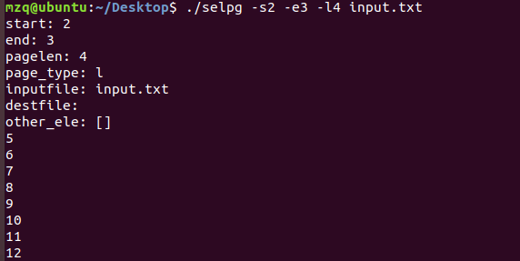

### CLI 命令行实用程序开发基础

#### 实验介绍

实验前先大概看了一遍课程网站的内容，前面的部分还是能接受，到后面管道部分就开始有点难度了。

先大概介绍使用到的包：

- pflags

```go

func get(args *selgpNode) {
	pflag.Usage = show_detail
	pflag.IntVarP(&args.start, "start", "s", 0, "start page")
	pflag.IntVarP(&args.end, "end", "e", 0, "end page")
	pflag.IntVarP(&args.pagelen, "pagelen", "l", 72, "how many lines in one page") 
	pflag.StringVarP(&args.pagetype, "pagetype", "f", "l", "...which way to split page")
	pflag.StringVarP(&args.dest, "destination", "d", "", "dest")
	pflag.Parse()
}
```

这就是使用到这个包的地方，就是方便我们取得console输入的参数的，并且帮助我们方便设置默认值，一些固定的参数，还是一些可有可无的参数（比如不知道是文件输入还是控制台输入、后面接了一个数组等等）直接使用

```go
temp := pflag.Args()
```

就可以获得数组，相当方便。

此外Usage这个属性也是帮我们封装好的，对应-h的使用，也就是console使用-h命令是会执行Usage（指针）的指向的函数。

- os

用于文件的读取，比如：

```go
content, err := os.Open(args.inputfile)
```

- bufio、io

io操作，文件进行读写的时候使用

#### 测试

由于课程网站的测试比较多，这里就简单测试几条指令

```
$ go build selpg.go
$ ./selpg -h
```


测试文件的输入，这是先用C++写了一个1 - 100每个数字一行的文件并取名为input.txt:



指定输出文件：


默认的页数的情况：


默认的一页72行，是正确的。

测试一下错误情况：


不使用文件输入的情况：


这里是结构体里面定义了一个预存console输入的多余的参数，然后对其进行操作即可。

大概的测试就是这样。

### [代码](https://github.com/iamcaiji/service-computing/tree/master/hw4)

