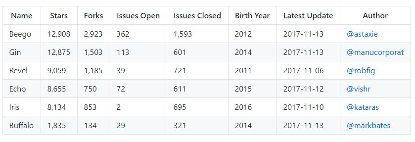
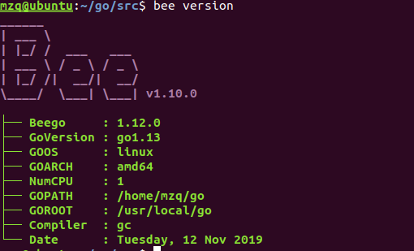
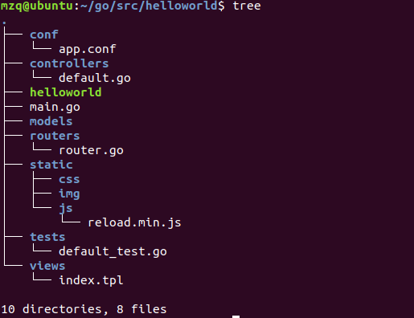
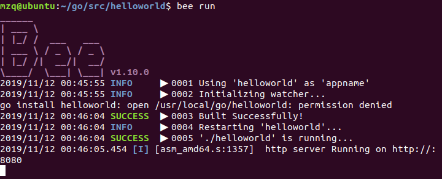
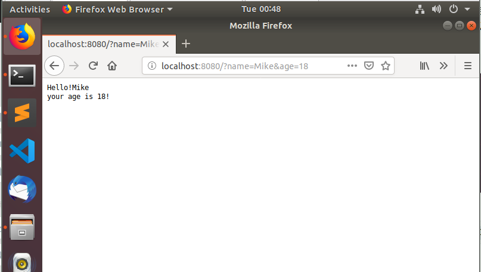
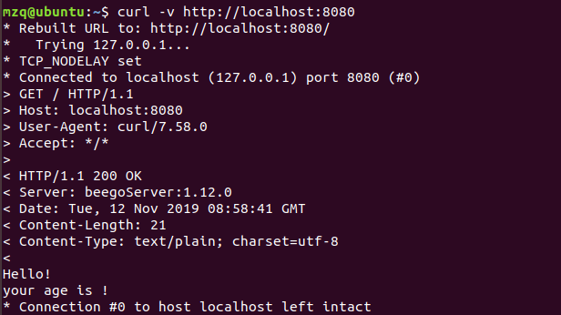
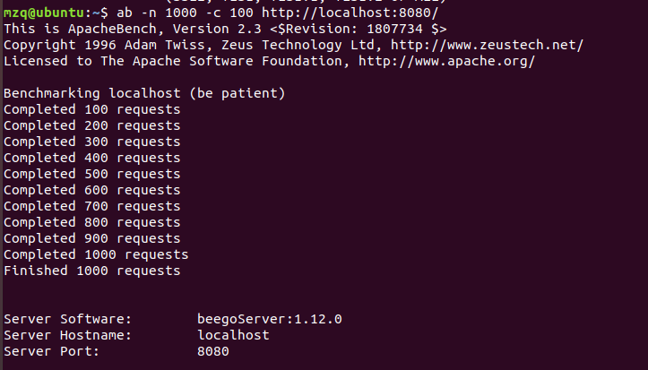
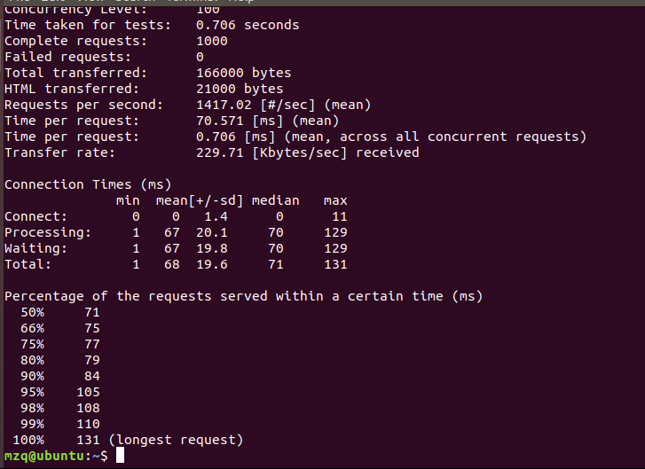

### Web小程序开发

#### 个人信息

| 学号     | 姓名   |
| -------- | ------ |
| 17343089 | 莫智强 |

#### 实验目的

1. 熟悉 go 服务器工作原理
2. 基于现有 web 库，编写一个简单 web 应用类似 cloudgo。
3. 使用 curl 工具访问 web 程序
4. 对 web 执行压力测试

#### 实验内容

- 选择框架

  虽然只是简单的任务，可能是输出helloworld，但是我们的目的主要是使用别人的框架，而不是直接使用net/http包进行编写代码。

  看到一个网上的博客(2017年数据)，目前最火的6个web服务框架如下：

  

  所以根据github上star的数量，我选择了最高的、最受欢迎的Beego框架

- 配置环境

  - 安装beego和bee工具（推荐按照官网步骤，坑已经排好）

    ```go
    go get github.com/astaxie/beego
    go get github.com/astaxie/bee
    ```

  - 安装后特别地配置好GOBIN、GOPATH等环境变量。如果没有问题的话，执行

    ```go
    bee version
    ```

    可以看到如下画面：

    

    表示安装成功。

  - **cd到你的GOPATH下的src目录**，创建新的项目

    ```go
    bee new helloworld
    ```

    上诉命令就创建了一个名叫helloworld的文件

    cd到helloworld

    

    文件结构如上，可以看到是标准的MVC架构，有models、controllers、views等，还有static里面的结构，看样子就是静态网页（文件）。

- 编写代码

  **现在我们要做的是最基础的，是去编写Controllers里的default.go**

  里面原本的代码：

  ```go
  package controllers
  
  import (
  	"github.com/astaxie/beego"
  )
  
  type MainController struct {
  	beego.Controller
  }
  
  func (c *MainController) Get() {
  	c.Data["Website"] = "beego.me"
  	c.Data["Email"] = "astaxie@gmail.com"
  	c.TplName = "index.tpl"
  }
  ```

  执行bee run，然后浏览器打开

  ```
  http://localhost:8080
  ```

  就可以看到bee的欢迎页面。

  下面开始编写自己的小程序Helloworld

  ```go
  package controllers
  
  import (
  	"github.com/astaxie/beego"
  )
  
  type MainController struct {
  	beego.Controller
  }
  
  func (c *MainController) Get() {
      tmp := c.GetString("name")
      age := c.GetString("age")
      out := "Hello!" + tmp + "\n" + "your age is " + age + "!\n";
      c.Ctx.WriteString(out)  
  }
  ```

  代码分析：其实定义了MainController这个结构就是获得beego.Controller的全部方法，所以我们写的那个函数实际上就是改写GET方法，同理你可以改写POST、DELETE等方法。

  **这里的GetString其实是获取我们在浏览器上输出的'?'后面的key-value，这里的意思是你输入姓名和年龄然后会返回字符串，内容是对你的问候**

- 运行

  

  运行成功，浏览器输出

  ```
  http://localhost:8080?name=Mike&age=18
  ```

  

  得到上面的效果！

  **如果你细心的话，会发现bee run之后其实命令一直没有结束啊。这就是bee的一个优点之一——热编译，每次只要你进行修改，只要保存就会自动再跑一遍，效果及时反馈在页面上，挺好！**

  至于其他请求，或者返回一些其他东西，还是要看源码和开发者文档，就只会用用GET，输出helloworld这样子了。但是不得不说beego还是简单好用的（没有用过其他框架所以没有对比性。。。）

- **使用curl工具访问web程序**

  

- **对web执行压力测试**

  

  参数解释：都是能看懂的，比如请求数量、失败的请求数量、发送的字节数、平均每秒的请求数量、最底下的百分数则表示

  50%的请求是低于71ms

  ·······

  100%的请求是低于131ms

#### 小结

框架很好用，但是我觉得如果要深入的话，还是要看go的net/http的源码，看beego是怎么实现封装的，这样以后其实是什么框架我觉得都是以不变应万变。

#### 代码运行

helloworld文件就是源代码，请把helloworld文件放到GOPATH/src下，并且安装好bee和beego环境，在此前提下安装cd到helloworld运行bee run，看到信息后即可浏览器访问http://localhost:8080

