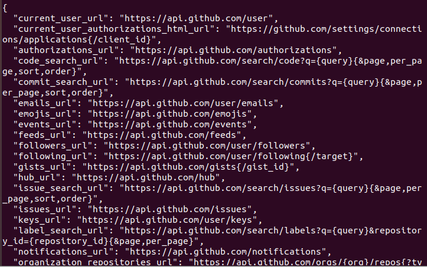

#### 实验题目

模仿github Api，用markdown编写设计一个博客网站的部分rest API.

#### 实验过程

首先看一下github API的格式是怎么样的？

直接看API我们都能知道每个返回的key-vaule是什么意思了，主页面的user、emojis、events等等，或者点进user之后的emails等，就很直观的我们甚至可以直接在API中输入这些信息就能访问对应网页。

所以下面开始我们博客网站的API设计，一个博客网站的首页如下：

所以对于当前页面API应该为：api/blog/{user_id}

隐私设置：api/blog/{user_id}/setting

> 然后进去之后应该是要修改首页、账户、密码、邮箱、手机什么的
>
> 所以又有 
>
> 修改首页：api/blog/{user_id}/setting/index
>
> 修改账户：api/blog/{user_id}/setting/account
>
> 修改密码：api/blog/{user_id}/setting/password
>
> 修改邮箱：api/blog/{user_id}/setting/email
>
> 修改手机：api/blog/{user_id}/setting/cellphone

博客页面：api/blog/{user_id}/articles

> 一般来说都是简单化
>
> 比如api/blog/{user_id}/articles/1，后接数字代表编号
>
> 我觉得更加规范的应该是接上文件的名字，包括后缀，github就是这样做的

资源页面：api/blog/{user_id}/resources

> 可以细分，比如api/blog/{user_id}/resources/excel和api/blog/{user_id}/resources/word，这里只是举个例子

论坛页面：api/blog/{user_id}/bbs

Blink页面：api/blog/{user_id}/blink

问答页面：api/blog/{user_id}/questions

> 这里的可能有几个固定的选项要填，比如年龄和性别
>
> 所以API可以是api/blog/{user_id}/questions?age={user_age}&gender={user_gender}

收藏页面：api/blog/{user_id}/favorite

专栏页面：api/blog/{user_id}/column