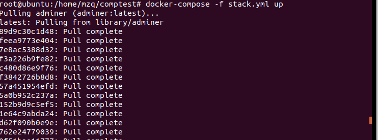

### docker

##### 定义

Docker的中文本意是码头工人，用于搬运货柜。[Docker官网](https://www.docker.com/)给出的解释是Docker是世界领先的软件货柜运输平台。通俗来说就是Docker就是一个可以将软件打包在一个标准的“货柜”里，并可以轻松迁移的平台。

##### 特点

**轻量性**
运行在一台机器上的容器共享其操作系统内核，它们启动使用更少的内存。Docker的镜像文件可以通过分层的文件系统及共享的公共文件创建（说白了就是Docker的镜像文件可以在其他镜像基础上创建并且还可以共享使用其他镜像或操作系统的文件，这样镜像文件就很小），节省磁盘空间并提高下载效率。
**开放性**
Docker容器基于开放标准，使容器能够在所有的主流Linux及windows或者其他设备的顶层运行。
**默认安全性**
容器隔离彼此和基础架构应用，同时为应用程序提供了额外的保护层。

##### 为什么使用docker

#### docker环境准备

**根据以上步骤，就把docker安装完了**

#### 运行第一个容器

#### docker基本操作

显示本地镜像库内容

获取帮助

显示运行中容器

显示所有容器

运行镜像

继续运行原容器并进入

#### MySQL与容器化

拉取MySQL镜像

构建docker练习对象

构建对象

启动服务器

启动客户端

挂载卷保存db

创建卷并挂载

#### Docker compose 与多容器应用自动化部署

下载docker-compose

编写stack.yml

启动服务

#### docker网络

备制支持 ifconfig 和 ping 命令的 ubuntu 容器

启动另一个命令窗口，由容器制作镜像

#### 容器监控与日志

查看某个具体容器的日志，这个是ubuntu容器日志

#### 小结

经过本次实验了解了docker的一些基本操作，以及docker是什么。体验到docker的神奇之处，正如课件提到容器化是革命性的技术。