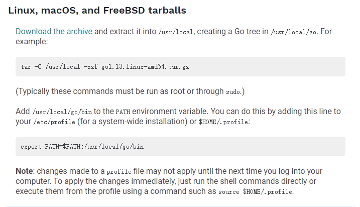
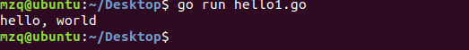
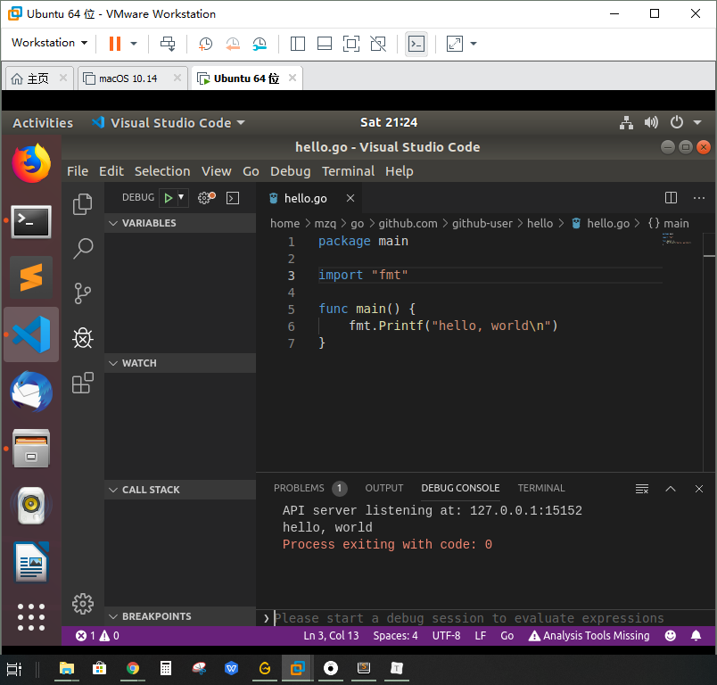
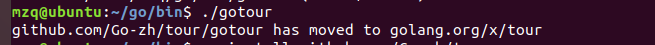
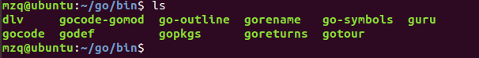
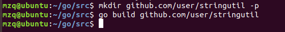
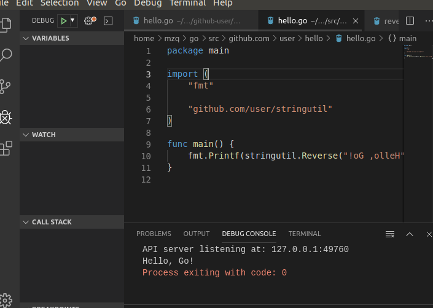
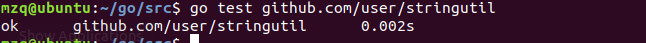

## 安装go语言开发环境

### 实验环境

ubuntu18.04

### 安装vscode

- 下载

  直接从官网下载deb文件

- 安装

  在对应文件夹下执行以下命令即可

  ```c
  sudo dpkg -i [文件名]
  code
  ```

### 配置golang环境

同样需要下载，下载了压缩包之后要进行解压和设置环境变量，官网有详细的说明。



之后就可以使用go了，先简单写个helloworld，控制台使用go run运行：



### 安装必要的工具和插件

这里我遇到很多的问题，vscode上面已经装好，但是要用vscode写go还要装很多插件，我们install all的时候会发现报错，就是网站被屏蔽了。但是其实golang在github上建立有一个镜像库，我们可以把需要的文件clone到对应的文件夹，但是我们要保证与正常下载的文件的文件名是一样的，这里课程网站已经说明得很清楚。

只要cd到

```go
/src/golang.org/x/
```

目录下输入

```go
git clone https://github.com/golang/tools.git
//如果你需要net包
git clone https://github.com/golang/net.git
```

即可。

当然，你要先安装git，比较简单，一个命令。

```c
sudo apt-get install git
```

然后一番乱搞之后，似乎可以在vscode上跑go语言了



### 安装gotour

原本已经是极为简单的两行代码

```go
$ go get github.com/Go-zh/tour/gotour
$ gotour
```

然后就

无法运行，然而bin下是有gotour的可执行文件的



不清楚为何，但是我感觉这个gotour可以在课程网站里面直接看，也就算了吧。

### 第一个库

- 首先第一步选择包路径	

  ```c
  $ mkdir $GOPATH/src/github.com/user/stringutil
  ```

- 接着创建名为revers.go的文件，内容如下：

  ```c
  // stringutil 包含有用于处理字符串的工具函数。
  package stringutil
  
  // Reverse 将其实参字符串以符文为单位左右反转。
  func Reverse(s string) string {
  	r := []rune(s)
  	for i, j := 0, len(r)-1; i < len(r)/2; i, j = i+1, j-1 {
  		r[i], r[j] = r[j], r[i]
  	}
  	return string(r)
  }
  ```

  使用go build命令来测试该包的编译：

  ```c
  $ go build github.com/user/stringutil
  ```

  

  没有出现错误就表示成功了。

  上面曾经在相同的user目录下创建过hello，在里面的hello.go上测试我们的代码，将其网站改成如下图：

  ```c
  package main
  
  import (
  	"fmt"
  
  	"github.com/user/stringutil"
  )
  
  func main() {
  	fmt.Printf(stringutil.Reverse("!oG ,olleH"))
  }
  ```

  运行（因为vscode已经配好所以就不使用go install ....../hello了）：

  

  可以看到字符串反转了。

### 测试库

我们可通过创建文件 `$GOPATH/src/github.com/user/stringutil/reverse_test.go` 来为 `stringutil` 添加测试，其内容如下：

```go
package stringutil

import "testing"

func TestReverse(t *testing.T) {
	cases := []struct {
		in, want string
	}{
		{"Hello, world", "dlrow ,olleH"},
		{"Hello, 世界", "界世 ,olleH"},
		{"", ""},
	}
	for _, c := range cases {
		got := Reverse(c.in)
		if got != c.want {
			t.Errorf("Reverse(%q) == %q, want %q", c.in, got, c.want)
		}
	}
}
```

接着使用go test运行该测试：



显示OK！

这里都是跟着课程网站上的Go编程介绍走的，我们现在可以不用太在意test文档如何写，只需要知道大致的开发步骤。

### 快排实验分享码

[](http://139.9.57.167:20080/share/blurbmmd0lit3phfpeu0?secret=false)


