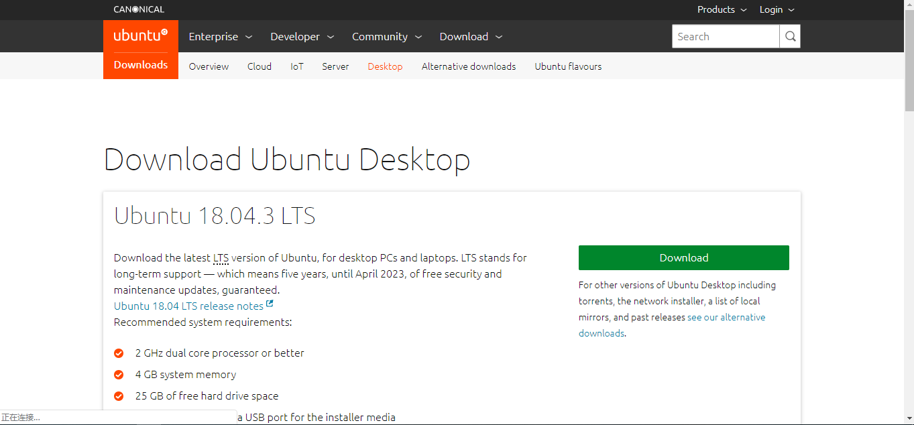
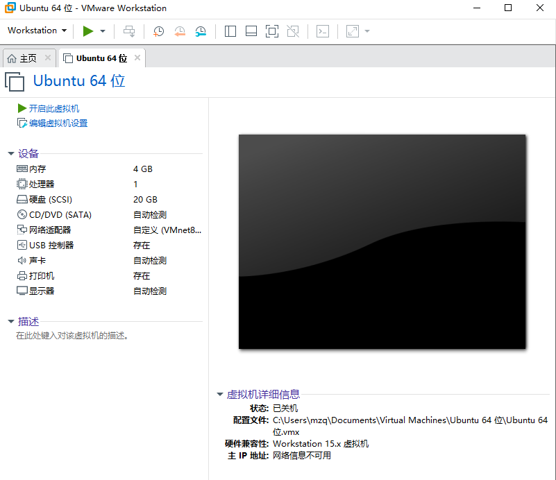
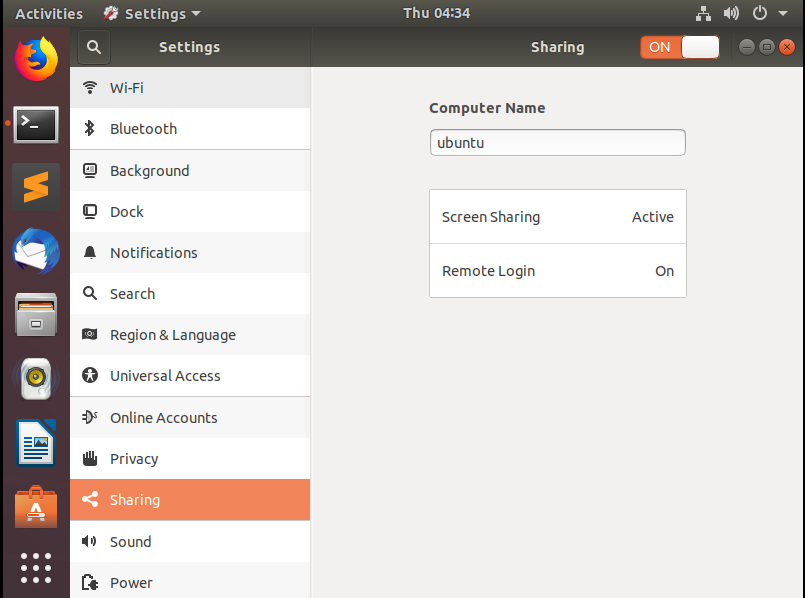
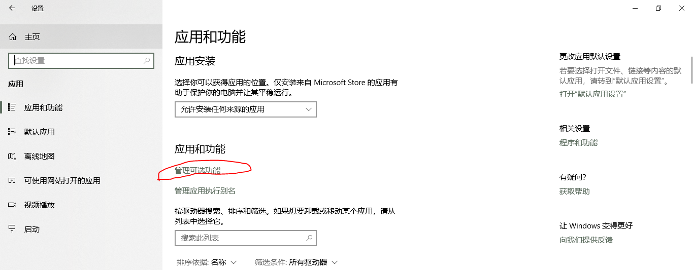
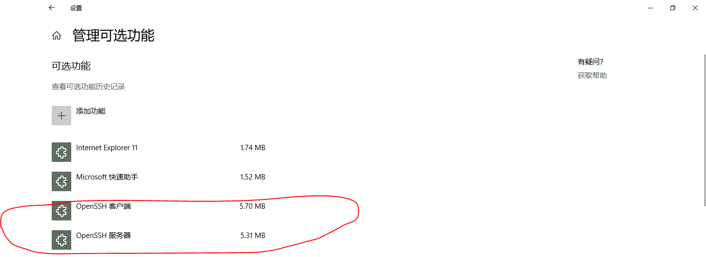
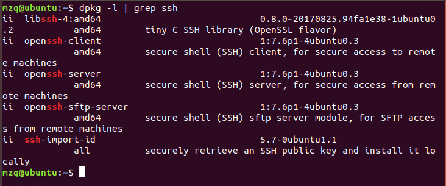
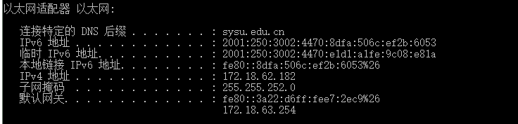
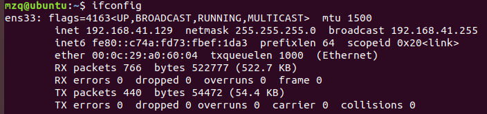
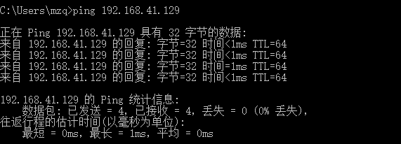
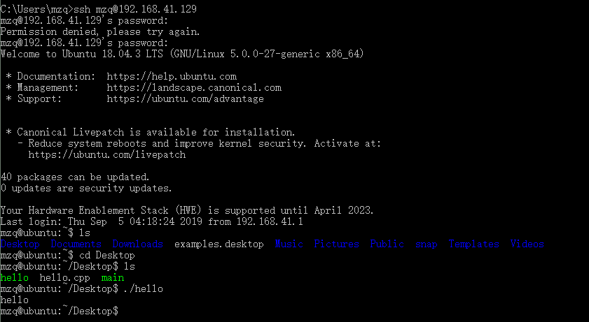

# 配置私有云实验

## 莫智强 17343089

### 实验环境

使用VMware软件配置虚拟机机，我选择ubunt18.04桌面版，个人觉得桌面版用起来比较方便，VMware和ubuntu镜像直接官网查询即可。



### 实验过程

因为以前装过虚拟机，所以安装过程比较熟练，没有遇到很大的问题。安装完成后进行了一些简单的设置，这里网络设置成NAT模式，这样虚拟机内部才能访问外部网络。



让我觉得奇怪的是，在决定使用VMware和ubuntu桌面版之前，实际上我是根据课程网站中所介绍的virtualbox和centOS这样的组合的，但是根据其步骤走下来之后，发现内容很多而且配置的过程比较复杂，而且我尝试了很久没有找到解决办法，无法从外部网络访问虚拟机，因此我放弃了这种方法。

但是使用VMware只有一种网络方式可选，就是NAT，但是很奇怪，外部也是可以虚拟机的。

然后还要在虚拟机里面设置可以共享。



然后我选择通过ssh的方法远程连接到ubuntu虚拟机，一般来说，如果没有主机没有开始ssh的客户端，我们添加此类功能，





确保你已经添加了以上功能，当然还要去openssh的官网下载，同时也要确保虚拟机里面的虚拟机也是开始了ssh服务的，一般来说ubuntu自带了ssh服务，使用一下命令查看其是否开启：

 ```c
dpkg -l | grep ssh
 ```



这里看到我的ssh的服务器和客户端功能都开启了，当然这是我已经下载过了，当然我开始弄的时候是没有开启的。

如果没有开始，可以使用以下命令安装：

```c
sudo apt-get install openssh-server
sudo apt-get install openssh-client
```

这样基本就搞定了。

#### 测试

- 本机ip



- 虚拟机ip



- 主机ping虚拟机



- 使用ssh连接虚拟机

总的来说，大致就配置成功了。

### 实验心得

我前面其实用virtualbox的时候也看到了同学在网上的博客，过程还是比较繁琐的，而且我在自己弄的时候遇到了各种各样的问题，与其描述不一样，最后也没有弄成功。所以选择换一种方式，其实按照网上的方法也不会太难吧，只是我的虚拟机经过多次删除和重装，centOS老是打不开，所以一气之下换成了VMware。还有比较令我震惊的是NAT模式是确保内部能访问外网的，但是外部无法访问内部；桥接模式是虚拟机的网卡与物理机的网卡直接进行通信；而host-only模式是只能用于实现虚拟机到虚拟机、虚拟机到物理机的连接的。我直接设置成NAT模式之后发现主机可以ping通虚拟机，挺奇怪的，不用经过麻烦的设置就直接可以远程连接了。


